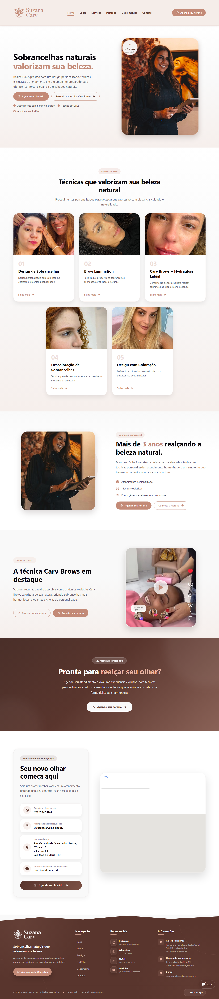

# Suzana Carv — Site Institucional



Site institucional responsivo desenvolvido em React para a marca **Suzana Carv**, especializada em design de sobrancelhas.

O projeto foi desenvolvido com foco em **experiência do usuário, apresentação profissional da marca, responsividade e conversão de visitantes em clientes**.

## 🌐 Projeto online

**Site:** https://suzana-carv-site.vercel.app

## 📌 Sobre o projeto

O site foi desenvolvido para apresentar a marca Suzana Carv no ambiente digital, destacando seus serviços, técnicas, portfólio, depoimentos e canais de contato.

A estrutura foi planejada para proporcionar uma navegação simples, elegante e intuitiva, com foco na apresentação dos serviços e na conversão através dos canais de atendimento.

## ✨ Principais funcionalidades

- Página inicial institucional
- Apresentação da marca
- Página de serviços
- Portfólio de trabalhos
- Depoimentos de clientes
- Página de contato
- Integração com WhatsApp
- Integração com Instagram
- Formulário de contato
- Assistente virtual
- Layout responsivo
- Navegação entre páginas com React Router
- SEO básico
- Configuração para compartilhamento
- Deploy em produção através da Vercel

## 🛠️ Tecnologias utilizadas

- React
- JavaScript
- Vite
- Bootstrap
- React Router
- Framer Motion
- React Icons
- Swiper
- EmailJS
- CSS
- HTML5
- Git
- GitHub
- Vercel

## 🧩 Estrutura do projeto

```text
suzana_carv_homepage/
│
├── api/
│   └── chat.js
│
├── docs/
│   └── screenshots/
│       └── home.png
│
├── public/
│
├── src/
│   ├── assets/
│   ├── components/
│   ├── layouts/
│   ├── pages/
│   ├── routes/
│   └── styles/
│
├── .gitignore
├── GUIA_EMAILJS.md
├── index.html
├── package.json
├── vercel.json
└── vite.config.js
🎨 Interface e experiência

O projeto utiliza uma identidade visual desenvolvida especificamente para a marca, com atenção especial a:

Hierarquia visual
Tipografia
Espaçamento
Responsividade
Microinterações
Call-to-actions
Apresentação de imagens
Experiência de navegação
Conversão de visitantes
📱 Responsividade

A interface foi desenvolvida seguindo uma abordagem responsiva, permitindo a utilização do site em diferentes tamanhos de tela:

Desktop
Notebook
Tablet
Smartphone
🚀 Deploy

O projeto está hospedado na Vercel e integrado ao repositório GitHub.

O código-fonte está organizado na branch main, permitindo a manutenção e evolução contínua do projeto.

📚 Objetivo do projeto

Além de atender às necessidades reais da marca Suzana Carv, este projeto representa uma etapa prática do desenvolvimento das minhas habilidades em:

Desenvolvimento Front-end
React
JavaScript
UI/UX
Design responsivo
Git e GitHub
Deploy
Organização de projetos
Estruturação de aplicações web
👨‍💻 Desenvolvido por

Carmindo Vasconcelos

Desenvolvedor Front-end em formação, com foco em desenvolvimento web, React, JavaScript, UI/UX e experiências digitais responsivas.

⭐ Projeto desenvolvido como parte do meu portfólio profissional.